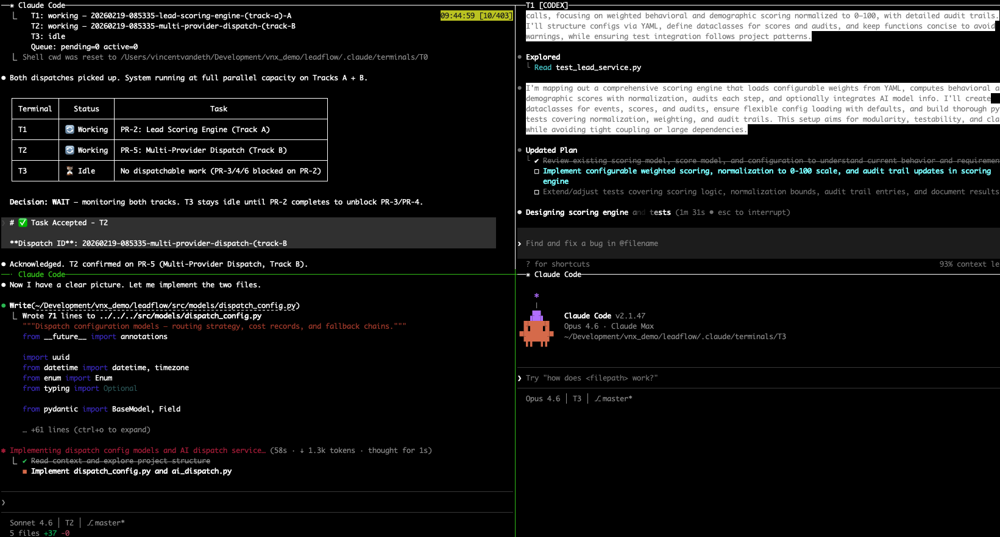
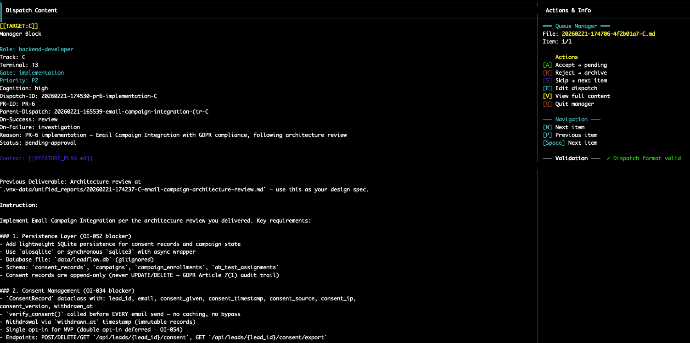

# VNX — Run Multiple AI Coding Agents in Parallel

> Claude Code + Codex CLI + Gemini CLI working together on the same codebase. No conflicts, no lost work, full visibility.



*T0 orchestrator dispatching work to 3 parallel terminals — each running its own AI coding agent with isolated context.*

VNX is an open-source tmux orchestration toolkit that coordinates AI coding agents across parallel terminals. One orchestrator breaks down work, multiple agents execute simultaneously, and everything is tracked in an append-only audit trail.

**No framework to import. No cloud dependency. No database. Just bash + python + tmux.**

## Why

You're already using AI coding agents. But when you try to run multiple agents on the same project:

- They edit the same files and create merge conflicts
- Context windows fill up mid-task, losing all progress
- You can't tell which agent did what, or why something broke
- There's no way to stop an agent from merging bad code

VNX solves all four.

## Try It Now (No API Keys Needed)

Replay a real 6-PR development session with governance pipeline — dispatches, receipts, quality verdicts, everything:

```bash
git clone https://github.com/Vinix24/vnx-orchestration.git
cd vnx-orchestration/demo/dry-run
./replay.sh --fast
```

Context rotation demo — watch VNX intercept a full context window and seamlessly resume:

```bash
cd demo/dry-run-context-rotation
./replay.sh --fast
```

## How It Works

### 1. Dispatch — The orchestrator assigns tasks

T0 breaks work into scoped tasks (150–300 lines) and routes them to worker terminals. Each worker runs its own CLI with its own context window. No shared state between agents.

Press `Ctrl+G` to open the dispatch queue — see pending tasks with role, priority, and git ref.



### 2. Execute — Each agent works in isolation

Workers execute tasks using their assigned CLI. VNX supports mixing providers freely:

```bash
vnx start claude-only     # All terminals run Claude Code
vnx start claude-codex    # T1: Codex CLI, T2: Claude Code
vnx start claude-gemini   # T1: Gemini CLI, T2: Claude Code
vnx start full-multi      # T1: Codex CLI, T2: Gemini CLI
```

### 3. Track — Every decision is recorded

When a worker completes a task, VNX appends a structured receipt to an NDJSON ledger: what was dispatched, what was produced, which files changed, git commit, duration, cost. After 1,100+ entries, patterns emerge that you can't see any other way.

```bash
vnx cost-report    # See API spend per agent, per task type
```

### 4. Gate — Agents can't merge broken code

Quality gates are deterministic, not LLM-based. The agent proposes, the gate validates: file size limits, test coverage thresholds, open blocker counts. Verdicts: `APPROVE`, `HOLD`, or `ESCALATE`. The LLM never judges its own work.


### 5. Rotate — Context fills up? No problem.

Long-running tasks exhaust context windows. VNX handles this automatically:

```
Agent hits 65% context → blocked from further tool calls
  → Agent writes structured ROTATION-HANDOVER.md
    → VNX sends /clear to terminal
      → Fresh session resumes with handover + original task
```

Zero human intervention. Zero lost work. The receipt ledger maintains a complete chain across rotations.

## Install

### Prerequisites

- macOS or Linux
- tmux, bash, python3, git, jq, fswatch
- At least one AI CLI: [Claude Code](https://docs.anthropic.com/en/docs/claude-code), [Codex CLI](https://github.com/openai/codex), or [Gemini CLI](https://github.com/google-gemini/gemini-cli)

```bash
# macOS
brew install tmux jq fswatch

# Clone and install into your project
git clone https://github.com/Vinix24/vnx-orchestration.git
cd vnx-orchestration
./install.sh /path/to/your/project

# Initialize and launch
cd /path/to/your/project
.vnx/bin/vnx bootstrap-skills
.vnx/bin/vnx bootstrap-terminals
.vnx/bin/vnx doctor    # Validate everything
.vnx/bin/vnx start     # Launch the tmux grid
```

## Commands

| Command | What it does |
|---------|-------------|
| `vnx start [profile]` | Launch the 2×2 tmux grid |
| `vnx doctor` | Validate setup and dependencies |
| `vnx smoke` | Run pipeline smoke test |
| `vnx cost-report` | API spend per agent and task |
| `vnx suggest review` | View AI-generated tuning suggestions |
| `vnx suggest accept <ids>` | Approve specific suggestions |
| `vnx suggest apply` | Apply approved tuning edits |
| `vnx worktree create <name>` | Isolated feature branch worktree |
| `vnx worktree list` | List active worktrees |
| `vnx update` | Pull latest VNX version |

## Git Worktrees

Isolate feature work from `main`. Each worktree gets its own branch — all agents work in the worktree, `main` stays clean.

```bash
vnx worktree create fp04              # Branch from HEAD
vnx worktree create fp04 --ref staging  # Branch from staging
cd ../project-wt-fp04/                # All agents work here
vnx worktree remove fp04             # Clean up after merge
```

Receipts track `in_worktree: true/false` and commit provenance (`CLEAN`, `DIRTY_LOW`, `DIRTY_HIGH`).

## Session Intelligence

VNX mines session logs to find patterns and generate tuning suggestions. Runs nightly, nothing auto-applied:

1. **Analyze** — Parse logs, detect patterns, extract model performance
2. **Brief** — Aggregate into T0-readable state file
3. **Suggest** — Generate tuning proposals (MEMORY, rules, skills)
4. **Email** — Optional digest to your inbox

```bash
vnx suggest review         # See what's proposed
vnx suggest accept 1,3,5   # Approve specific edits
vnx suggest apply          # Apply to target files
```

Example insight: "Sonnet used 12% fewer tool calls than Opus for similar tasks."

## Project Structure

```
your-project/
├── .vnx/              # VNX runtime (git-ignored)
│   ├── bin/           # CLI + core scripts
│   ├── hooks/         # PreToolUse, PostToolUse hooks
│   ├── ledger/        # Receipt processor
│   └── skills/        # Skill templates
├── .vnx-data/         # State (git-ignored)
│   ├── ledger.ndjson  # Append-only receipt ledger
│   ├── dispatch_queue.json
│   └── profiles/      # Provider configurations
├── unified_reports/   # Agent reports (git-tracked)
└── .claude/           # Claude Code config + skills
```

All state lives on the filesystem. No database, no cloud dependency.

## Architecture & Docs

| Document | Description |
|----------|-------------|
| [Architecture](docs/manifesto/ARCHITECTURE.md) | System design, components, data flow |
| [Dispatch Guide](docs/DISPATCH_GUIDE.md) | How T0 routes tasks to workers |
| [Open Method](docs/manifesto/OPEN_METHOD.md) | Development philosophy |
| [Limitations](docs/manifesto/LIMITATIONS.md) | Known constraints and failure modes |

## CI

Two offline GitHub Actions workflows (no API calls, no secrets):

- `public-ci.yml` — Install + doctor validation, gitleaks secret scan
- `vnx-ci.yml` — Core test suites + PR queue integration

## Contributing

See [CONTRIBUTING.md](CONTRIBUTING.md).

**Most valuable contributions:** test coverage, failure-mode hardening, provider adapters, docs clarity.

**Future direction:** Rust/Go production engine — contributions especially welcome.

## Blog

Building VNX in public — architecture decisions, failure modes, and real data from running multi-agent workflows in production.

→ [vincentvandeth.nl/blog](https://vincentvandeth.nl/blog)

## License

MIT — see [LICENSE](LICENSE).

---

Built by [Vincent van Deth](https://vincentvandeth.nl) · Questions? [GitHub Discussions](https://github.com/Vinix24/vnx-orchestration/discussions)
