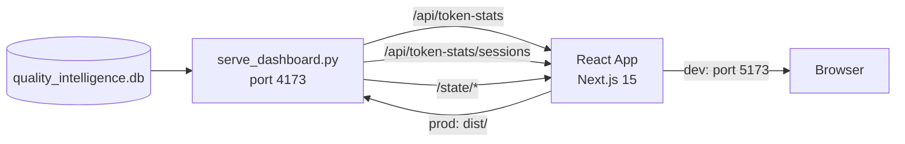

# VNX Token Usage Dashboard — TTD

## Architecture



### Components

| Layer | Technology | Role |
|-------|-----------|------|
| Data | SQLite (`quality_intelligence.db`) | Session analytics storage |
| API | Python (`serve_dashboard.py`) | JSON endpoints, SQLite queries |
| Frontend | Next.js 15, Recharts, shadcn/ui, Tailwind v4 | Interactive dashboard |
| Base | [Claud-ometer](https://github.com/deshraj/Claud-ometer) fork | UI shell and chart components |

## Token Metrics Specification

### Understanding Claude Code Token Fields

Each Claude API call returns usage data with 4 token fields:

```json
{
  "usage": {
    "input_tokens": 3,
    "output_tokens": 113,
    "cache_creation_input_tokens": 46817,
    "cache_read_input_tokens": 16944
  }
}
```

| Field | Meaning |
|-------|---------|
| `input_tokens` | New input not served from cache |
| `output_tokens` | Claude's response |
| `cache_creation_input_tokens` | Input newly written to prompt cache |
| `cache_read_input_tokens` | Input served from prompt cache (90% cost reduction) |

**Fundamental relationship per API call:**

```
context_window_size = input_tokens + cache_creation_tokens + cache_read_tokens
```

This equals the total context sent to the model (max ~200K). Output tokens are separate.

### Database Storage

The `session_analytics` table stores **cumulative sums** across all API calls in a session:

| Column | Stores |
|--------|--------|
| `total_input_tokens` | SUM of `input_tokens` across all calls |
| `total_output_tokens` | SUM of `output_tokens` across all calls |
| `cache_creation_tokens` | SUM of `cache_creation_input_tokens` across all calls |
| `cache_read_tokens` | SUM of `cache_read_input_tokens` across all calls |
| `assistant_message_count` | Count of API calls (= number of assistant messages) |

### Correct Metric Formulas

All dashboard displays MUST use per-call averages, not cumulative totals.

#### 1. Context Per Call (K tokens)

```sql
ROUND(
  (total_input_tokens + cache_creation_tokens + cache_read_tokens) * 1.0
  / NULLIF(assistant_message_count, 0)
  / 1000.0, 0
) AS context_per_call_K
```

**Expected range**: 50K-150K. If >200K, indicates a parser bug.

#### 2. Cache Hit Ratio (%)

```sql
ROUND(
  cache_read_tokens * 100.0
  / NULLIF(total_input_tokens + cache_creation_tokens + cache_read_tokens, 0), 1
) AS cache_hit_pct
```

**Expected range**: 90-97% for active sessions.

#### 3. New Tokens Per Call (K tokens)

```sql
ROUND(
  (total_input_tokens + cache_creation_tokens) * 1.0
  / NULLIF(assistant_message_count, 0)
  / 1000.0, 1
) AS new_per_call_K
```

**Expected range**: 3-10K (user message + tool output delta).

#### 4. Output Per Call (K tokens)

```sql
ROUND(
  total_output_tokens * 1.0
  / NULLIF(assistant_message_count, 0)
  / 1000.0, 1
) AS output_per_call_K
```

**Expected range**: 0.1-2K per call.

#### 5. Session Intensity

```sql
assistant_message_count AS api_calls
```

### Anti-Patterns (DO NOT use)

| Anti-Pattern | Why It's Wrong |
|-------------|---------------|
| `input + output` as "total tokens" | Excludes 96% of actual context (cached tokens) |
| Cumulative sum as "session size" | 33M cumulative ≠ 33M context; it means ~100K × 300 calls |
| `cache_read` as "free" | 90% cheaper, not free (relevant for API key billing) |

### Validation Query

Run this to verify dashboard data integrity:

```sql
SELECT session_id, terminal,
  ROUND(
    (total_input_tokens + cache_creation_tokens + cache_read_tokens) * 1.0
    / NULLIF(assistant_message_count, 0) / 1000.0, 0
  ) AS context_per_call_K
FROM session_analytics
WHERE assistant_message_count > 0
ORDER BY context_per_call_K DESC
LIMIT 5;
```

- Values >200 indicate a data collection bug
- Values <10 indicate a very short session or missing token data

## API Contract

### `GET /api/token-stats`

Aggregated token statistics with configurable grouping.

**Query Parameters:**

| Param | Type | Default | Description |
|-------|------|---------|-------------|
| `from` | DATE | 30 days ago | Start date (inclusive) |
| `to` | DATE | today | End date (inclusive) |
| `group` | ENUM | `day` | Grouping: `day`, `week`, `month` |
| `terminal` | TEXT | all | Filter by terminal name |
| `model` | TEXT | all | Filter by model name |

**Response:**

```json
[
  {
    "period": "2026-03-04",
    "terminal": "T-MANAGER",
    "model": "claude-opus",
    "sessions": 3,
    "api_calls": 412,
    "context_per_call_K": 108,
    "cache_hit_pct": 96.2,
    "new_per_call_K": 4.3,
    "output_per_call_K": 0.8,
    "total_output_tokens": 12450,
    "activities": ["debugging", "mixed"]
  }
]
```

### `GET /api/token-stats/sessions`

Individual session details for drill-down.

**Query Parameters:**

| Param | Type | Default | Description |
|-------|------|---------|-------------|
| `date` | DATE | required | Session date |
| `terminal` | TEXT | all | Filter by terminal |

**Response:**

```json
[
  {
    "session_id": "abc123",
    "terminal": "T-MANAGER",
    "model": "claude-opus",
    "date": "2026-03-04",
    "api_calls": 299,
    "context_per_call_K": 111,
    "cache_hit_pct": 96.0,
    "output_per_call_K": 0.1,
    "duration_minutes": 598,
    "primary_activity": "mixed",
    "tool_calls_total": 842,
    "has_error_recovery": true
  }
]
```

## Claud-ometer Adaptation

### Files to Modify

| Original File | Change | Purpose |
|--------------|--------|---------|
| `src/lib/claude-data/reader.ts` | Replace JSONL parsing with SQLite HTTP fetch | Data source swap |
| `src/lib/claude-data/types.ts` | Add terminal, cache fields to Session type | Schema alignment |
| `src/components/` | Add TerminalFilter component | VNX-specific filtering |
| `src/app/page.tsx` | Add terminal comparison and cache efficiency views | New dashboard views |

### Files to Keep As-Is

- Chart components (Recharts wrappers) — reuse directly
- Layout, theme, navigation — maintain Claud-ometer look
- Session browser — works with adapted data types
- Export/import — adapt to SQLite backup format

## Component Structure

```
src/
  app/
    page.tsx               # Overview (KPIs + charts)
    tokens/page.tsx        # Token Analysis view
    terminals/page.tsx     # Terminal Comparison view
    models/page.tsx        # Model Performance view
  components/
    KPICards.tsx           # Existing (adapt metrics)
    PeriodSelector.tsx     # New: day/week/month + date range
    TerminalFilter.tsx     # New: terminal multi-select
    TokenChart.tsx         # Existing (adapt data shape)
    CacheEfficiency.tsx    # New: cache hit trend chart
    TerminalComparison.tsx # New: grouped bar + radar
    ModelPerformance.tsx   # New: side-by-side model cards
    SessionTable.tsx       # Existing (add terminal column)
    ActivityHeatmap.tsx    # Existing (works as-is)
  hooks/
    useTokenStats.ts       # SWR hook for /api/token-stats
  lib/
    api.ts                 # Fetch wrapper for API endpoints
    metrics.ts             # Token calculation helpers (mirrors SQL formulas)
```

## Build and Deploy

### Development

```bash
npm run dev     # Vite dev server on :5173
                # Proxies /api/* to :4173 (serve_dashboard.py)
```

### Production

```bash
npm run build   # Output to dist/
                # Served statically by serve_dashboard.py at /token-dashboard/
```

### Integration with Existing Dashboard

The existing VNX system dashboard (`index.html`) runs on port 4173. The token dashboard is served from the same server under `/token-dashboard/`. A link in the existing dashboard navigation connects to it.

No additional processes, ports, or services required.
